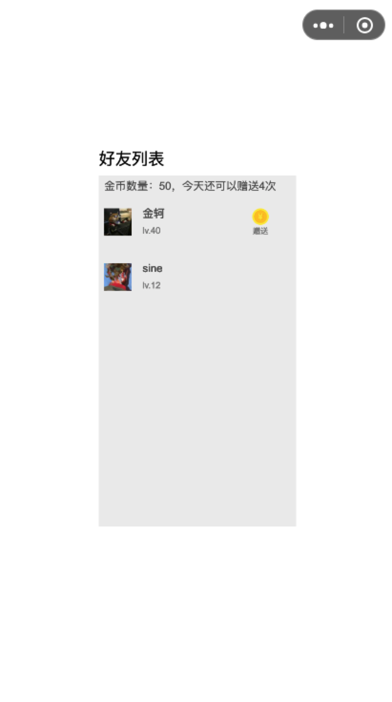

## 小游戏关系链互动示例代码

### 后台部分
1. 进入`server`安装依赖 `npm install`
2. 修改`server/config/index.js`中的`APPID`和`SECRET`为你的`APPID`和`SECRET`
3. 启动后台服务 `npm run start`

### 小游戏部分
4. 使用微信开发者工具打开当前小游戏项目`game`
5. 开发环境下对微信开发者工具设置：详情--本地设置--【勾选】微信小程序合法域名配置-不校验合法域名、web-view（业务域名）、TLS 版本以及 HTTPS 证书

### 示例小游戏界面

### 示例小游戏关系链交互说明
1. 用户首次登录游戏会获得50个金币
2. 用户每天可以对5个好友赠送金币，同一好友每天只能赠送一次，赠送金币的行为不会扣除自身的金币
3. 被赠送金币的好友金币数量加一
4. 不可对自己赠送金币